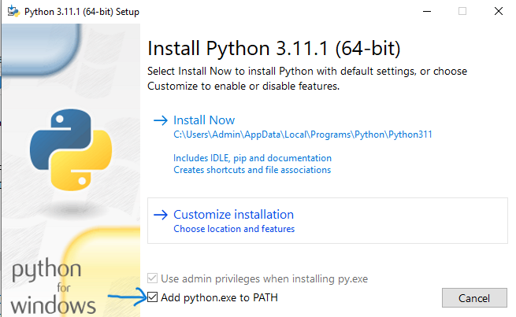

# hướng dẫn cài đặt chương trình trên window (Một số lệnh chạy có thể thay đổi khi áp dụng trên hệ điều hành khác)
# cài đặt python (cài đặt theo link dưới)
https://www.python.org/ 
 
Khi cài đặt python.exe, hãy chọn "Add python.exe to PATH" (như hình bên dưới)

# clone project
git clone https://github.com/tuannt2000/IT4652_V2.git

# cài đặt thư viện để chạy chương trình
pip install -r requirements.txt

# chạy chương trình
py main.py
